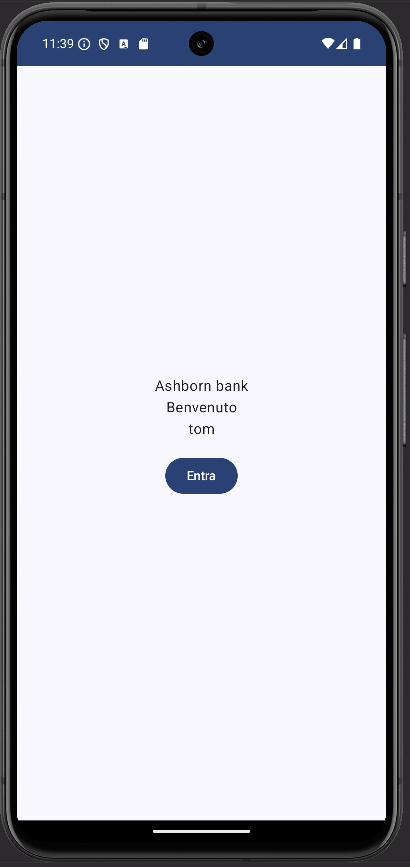
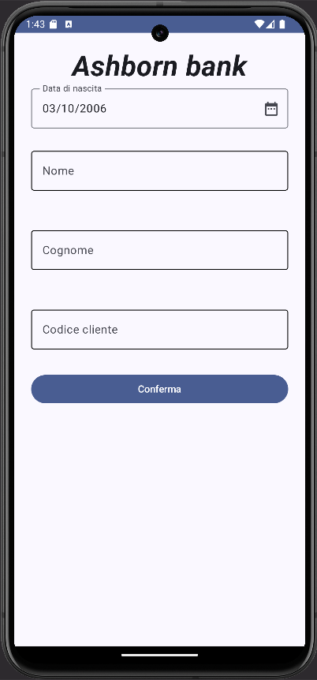
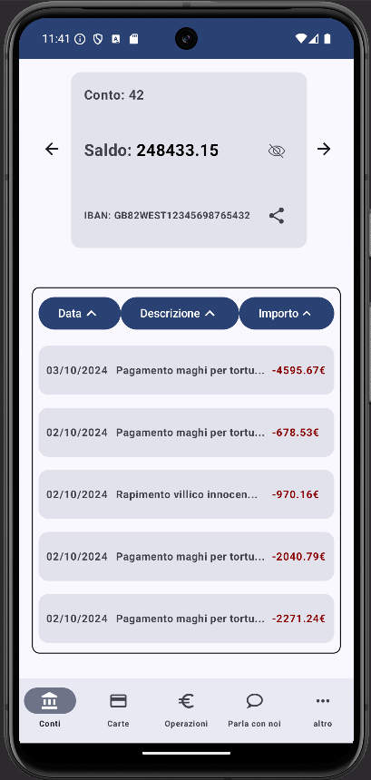
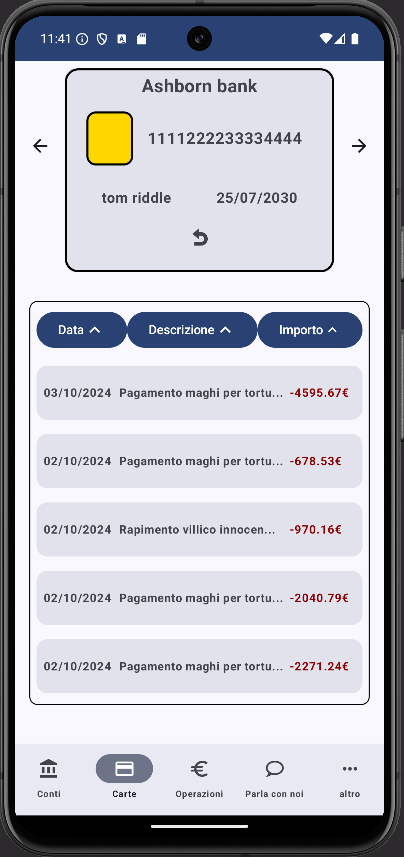

# 🏦 Ashborn Bank

> Un'applicazione Android di internet banking sviluppata per il corso di **Programmazione Dispositivi Mobili**.

**Autori:** Marius Dumitru Berinde, Giorgio Perna  
**Gruppo:** Full Metal Dev  
**Data:** Ottobre 2024

---

## 📋 Descrizione

Ashborn Bank è un'app di internet banking per Android ispirata alle principali app bancarie italiane (Intesa SanPaolo, Fineco), con l'obiettivo di semplificare le operazioni più comuni e rendere più accessibili funzionalità spesso nascoste, come il disconoscimento di un'operazione sospetta.

---

## ✨ Funzionalità principali

- **Autenticazione sicura** — Registrazione al primo accesso, login tramite PIN a 8 cifre con gestione dei tentativi errati e blocco temporaneo progressivo
- **Gestione conti** — Visualizzazione movimenti, saldo (mostrabile/nascondibile), IBAN condivisibile, cambio conto
- **Gestione carte** — Visualizzazione movimenti per carta, dettagli fronte/retro, cambio carta
- **Bonifico** — Modalità normale e istantanea, con validazione IBAN (algoritmo mod 97) e campi obbligatori
- **Pagamento MAV** — Inserimento manuale o tramite scansione QR code (Android 13+)
- **Disconoscimento operazione** — Richiesta semplificata direttamente dai dettagli di un movimento
- **Avvisi bancari** — Visualizzazione, dettaglio e condivisione delle comunicazioni della banca
- **Parla con noi** — Contatti dell'assistenza clienti
- **Notifiche push** — Simulazione utilizzo carta con notifica in tempo reale

---

## 🛠️ Stack tecnologico

| Tecnologia | Utilizzo |
|---|---|
| **Kotlin** | Linguaggio di sviluppo |
| **Jetpack Compose** | Interfaccia utente dichiarativa |
| **MVVM** | Pattern architetturale |
| **Room** | Database locale |
| **DataStore** | Preferenze e stato locale (PIN, utente attivo) |
| **Coroutines + Flow + LiveData** | Programmazione asincrona e reattiva |
| **CoroutineWorker** | Servizi in background (DBWorker, PaymentWorker) |
| **Google Code Scanner** | Lettura QR code per pagamenti MAV |

---

## 📂 Struttura del progetto

```
app/
├── dao/            # Accesso diretto al database (AshbornDao)
├── data/           # Data class per operazioni CRUD
├── database/       # Configurazione e inizializzazione del database
├── model/          # DataStoreManager (preferenze locali)
├── repository/     # Repository tematici:
│   ├── ContiRepository
│   ├── CardRepository
│   ├── AvvisiRepository
│   ├── OperationRepository
│   └── OfflineUserRepository
├── view/           # Schermate dell'app (Composable)
│   ├── login/
│   └── operazioni/
└── viewModel/      # ViewModel per ciascuna view
```

---

## 🗄️ Schema del database

Il database Room è composto dalle seguenti tabelle:

- **users** — Dati degli utenti registrati
- **operations** — Tutte le operazioni bancarie (con stato `PENDING` / `COMPLETED`)
- **conti** — Conti correnti degli utenti
- **carte** — Carte associate ai conti
- **avvisi** — Comunicazioni dalla banca

---

## 🔐 Sicurezza

- Screenshot bloccati tramite `FLAG_SECURE` nella `MainActivity`
- Orientamento forzato in verticale (`sensorPortrait`)
- Re-autenticazione tramite PIN dopo 5 minuti di inattività o quando l'app è in background
- Hash del PIN verificato contro il valore memorizzato nel database
- Blocco dell'app senza connessione internet attiva

---

## 📡 Servizi in background

| Servizio | Descrizione |
|---|---|
| `DBWorker` | Completa le transazioni pendenti verso clienti della stessa banca (ogni ~20 min) |
| `PaymentWorker` | Simula pagamenti casuali con carta e invia notifiche push (ogni ~20 min) |

---

## 📱 Compatibilità

- **Minimo:** Android 10 (API 29)
- **Target:** Android 14/15 (API 35)
- **QR code MAV:** Android 13+ (API 33)
- **iOS:** Non supportato

### Dispositivi testati

| Dispositivo | API |
|---|---|
| Medium Phone | 35 (Android 14/15) |
| Pixel 8 | 35 (Android 14/15) |
| Pixel 7 | 33 (Android 13) |
| Pixel 6 | 31 (Android 12) |
| Pixel 5 | 30 (Android 11) |
| Pixel 4 | 29 (Android 10) |
| Medium Tablet | 35 (Android 14/15) |

---

## 🧪 Test

- **Unit test** — `OperationViewModelTest` con approccio TDD per la validazione degli input
- **Beta test** — 8 utenti esterni + 2 sviluppatori su diverse fasce d'età; test su registrazione, bonifico, MAV (QR e manuale), revoca operazione, cancellazione avvisi

---

## ⚠️ Assunti e vincoli

- L'utente possiede già un **codice cliente** fornito dalla filiale bancaria
- I pagamenti sono **fittizi** (simulati localmente)
- La cancellazione di un'operazione implica il rimborso automatico dell'importo
- Un solo dispositivo per volta per utente
- Non sono gestiti conti aziendali né carte prepagate

---

## 📌 Funzionalità non implementate

- **Pagamento RAV** — Rimosso per complessità del riconoscimento immagini
- **Archivio** — Non sviluppato per i limiti del backend simulato
- **Disconoscimento completo** — Parzialmente implementato; la verifica documentale richiederebbe un backend reale

---

## 🖼️ Screenshot

| Welcome | PIN | Registrazione |
|:---:|:---:|:---:|
|  |  |  |

| Conti | Carte | Dettagli Operazione |
|:---:|:---:|:---:|
|  |  |  |

> 💡 Aggiungi la cartella `screenshots/` con i tuoi screenshot per completare questa sezione.

---

## 📄 Licenza

Progetto universitario — tutti i diritti riservati agli autori.
